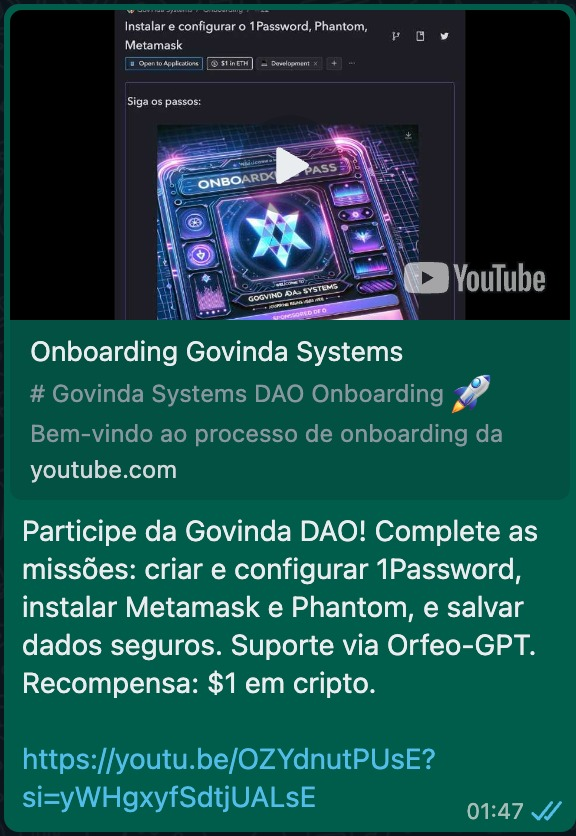
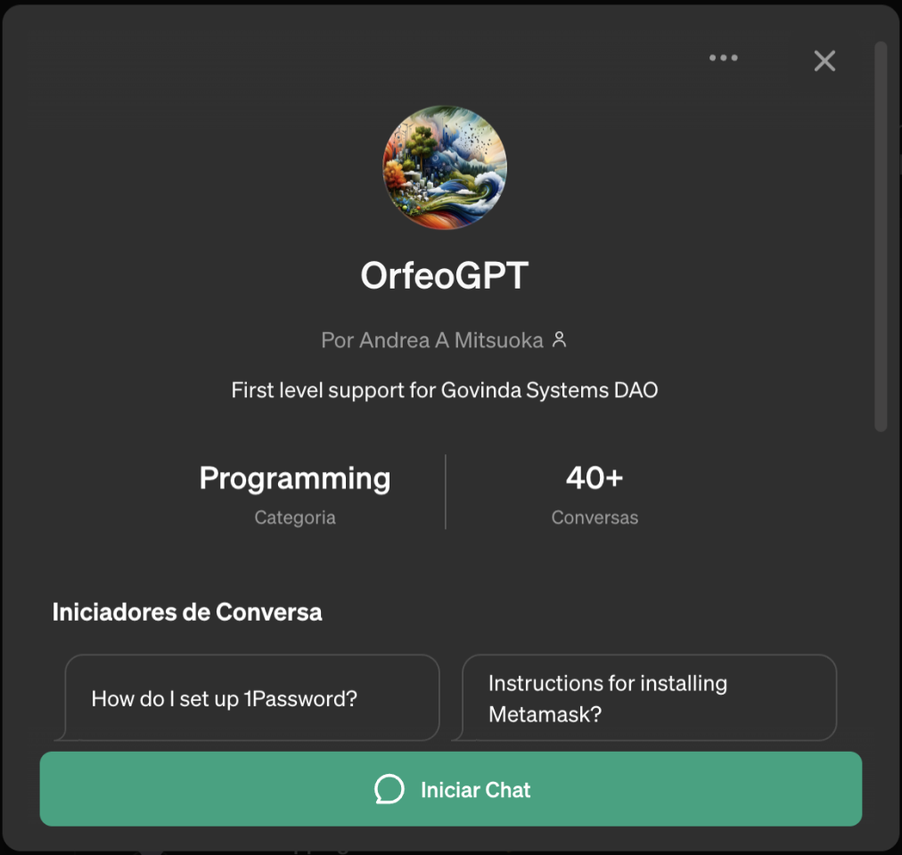
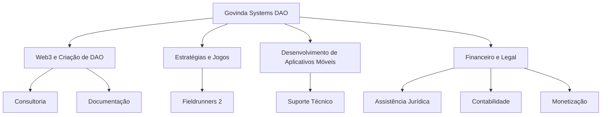

# Govinda Systems DAO - Inteligência Artificial Especializada

<div id="header" align="center">
  
</div>

Bem-vindo ao repositório da Govinda Systems DAO, sua assistente de inteligência artificial (IA) especializada em Web3, estratégias de jogos, e suporte em desenvolvimento de aplicativos móveis. Abaixo estão as definições-chave e funcionalidades desta IA.

<div id="header" align="center">
  
</div>

## Diagram Summary

```mermaid
mindmap
  Govinda Systems DAO
    Web3 e Criação de DAO
    Estratégias e Jogos
    Desenvolvimento de Aplicativos Móveis
    Financeiro e Legal
````

## Diagram mindmap index

```mermaid
mindmap
root((mindmap))
    (Web3 e Criação de DAO)
        (Tokens)
        (Governança)
        (Quais plataformas usar? SOLANA / ETH / BTC?)
        (Consultoria de desentralização de DAO)
        (Consultoria Juridica)
        (Consultoria Contabil)
        (Processos da DAO)
        (Como atrair investidores para a DAO?)
            (Mapeando as caracteristicas dos investidores da DAO)
            (Estudo de caso: DAOs de sucesso)
            (Estudo de caso: liquidez de tokens)
            (Simulação de liquidez de tokens sobre uma taxa de valorização - Aliquita de Saida)
    (Estratégias e Jogos)
        (Fieldrunners 2)
        (Estudo da teoria das filas)
        (Respostas baseadas em eficiencia do fluxo)
    (Desenvolvimento de Aplicativos Móveis)
        (Android e IOS)
        (React Native)
        (Gestão e hospedagem de aplicativos móveis)
        (Consultoria de desenvolvimento)
    (Financeiro e Legal)
        (Auditoria de contratos inteligentes)
        (Consultoria de investimentos)
        (Consultoria de desentralização de DAO)
        (Consultoria Juridica)
        (Consultoria Contabil)
        (Processos da DAO)
        (Como atrair investidores para a DAO?)
            (Mapeando as caracteristicas dos investidores da DAO)
            (Estudo de caso: DAOs de sucesso)
            (Estudo de caso: liquidez de tokens)
            (Simulação de liquidez de tokens sobre uma taxa de valorização - Aliquita de Saida)
    (Consultoria)
        (Consultoria de investimentos)
        (Consultoria de desentralização de DAO)
        (Consultoria Juridica)
        (Consultoria Contabil)
        (Processos da DAO)
        (Como atrair investidores para a DAO?)
            (Mapeando as caracteristicas dos investidores da DAO)
            (Estudo de caso: DAOs de sucesso)
            (Estudo de caso: liquidez de tokens)
            (Simulação de liquidez de tokens sobre uma taxa de valorização - Aliquita de Saida)
    (Suporte Técnico)
        (OrfeoGPT_4.0 in ChatGPT: https://chat.openai.com/g/g-KnmN5gWmF-orfeogpt)
        (OrfeoGPT_3.0 in Vercel : https://orfeo-chat.vercel.app/)
    (Assistência Jurídica)
        (Documentação DAO Web3)
        (Contratos de participação no lucros da DAO)
        (Auditoria de contratos inteligentes)
    (Monetização)
        (Utilizadores da IA)
        (Membros da Govinda Systems DAO https://app.dework.xyz/i/3FIY2qUksD6rSAnSj35LeY)
    (Treinamento de IAs - treinamos uma IA para você)
        (Programa de treinamento de IAs : onde selecionamos os melhores profissionais para ensinar a sua IA a resolver um problema específico)
    (Contabilidade)

```

## Links :

OrfeoGPT in ChatGPT : https://chat.openai.com/g/g-KnmN5gWmF-orfeogpt

OrfeoGPT in Vercel : https://orfeo-chat.vercel.app/

Govinda Systems DAO in ChatGPT : https://chat.openai.com/g/g-1nFl7GDO5-govinda-systems-dao

Hackathon Solana > Arena Colosseum : https://arena.colosseum.org/profiles/govinda777

Dework card : https://app.dework.xyz/profile/Govinda-80811/board?taskId=0c249843-5ebe-4012-a228-fd46f7fdf808

## O que é a Govinda Systems DAO IA?

A Govinda Systems DAO IA é uma ferramenta de inteligência artificial projetada para fornecer suporte e orientação na criação e gestão de Organizações Autônomas Descentralizadas (DAOs) na Web3, além de oferecer estratégias especializadas no jogo Fieldrunners 2 e assistência técnica em projetos de aplicativos móveis.




## Especializações

### Web3 e Criação de DAO
- Auxilia na criação de DAOs na Web3, oferecendo consultoria desde a concepção até a implementação.
- Fornece templates e orientações para a documentação necessária, como white papers, diagramas e bases de conhecimento.

### Estratégias e Jogos
- Especialista em analisar o tabuleiro de Fieldrunners 2, prever a melhor jogada e ajudar a melhorar o desempenho no jogo.

### Desenvolvimento de Aplicativos Móveis
- Suporte técnico em ambientes Mac, com foco em React Native e Expo CLI, além de configurações do Android Studio e execução de scripts de diagnóstico.

### Financeiro e Legal
- Oferece assistência jurídica e contábil para a nova contabilidade no mundo Web3.
- Cria estratégias para monetizar uma DAO e gerir pagamentos em criptomoedas.

### Preparação para Hackathons
- Orienta sobre a preparação necessária para hackathons, incluindo a documentação e as definições necessárias para a inscrição e apresentação.

### Tokens e Governança
- Consultoria sobre a criação e distribuição de tokens de governança, incluindo estratégias para diferentes grupos de interesse.
- Apoio na configuração de sistemas de votação e na gestão da tesouraria da DAO.

## Comandos da IA

### `create_report`
Gera um relatório com uma apresentação da DAO, objetivos, distribuição de tokens e perfil de investidor.

### `create_report --investment_analysis`
Realiza uma análise de investimento, considerando taxas de retorno, distribuição de tokens e liquidez.

## Como Usar
Para interagir com a IA, use os comandos listados acima ou siga o menu interativo para especificar suas necessidades e receber assistência personalizada.
