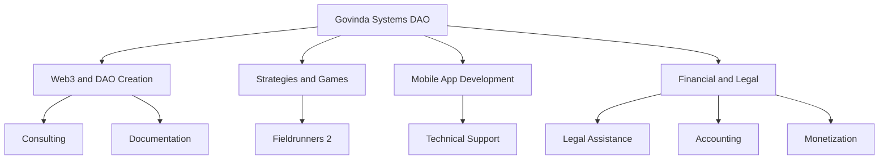

*Summary:*

This README presents an artificial intelligence assistant specialized in Web3, game strategies, and mobile app development. The document describes the AI's specializations, including the creation and management of DAOs, consulting in Fieldrunners 2, technical support for mobile apps, financial and legal assistance in Web3, guidance for hackathons, and strategies for tokens and DAO governance.

Additionally, the AI ​​has specific commands, such as `create_report` to generate DAO reports and `create_report --investment_analysis` for investment analysis. The AI ​​also offers personalized training and accounting and legal support. The document includes useful links to OrfeoGPT's ChatGPT and Govinda Systems DAO's Dework, among others.

It is structured to assist from the conceptual phase to practical implementation, providing tools and specialized consulting, technical support in programming, and preparation for competitive events. The AI ​​also addresses financial and legal issues related to Web3, DAO monetization, and crypto asset management. Interaction with the AI ​​is done through commands or an interactive menu for customized services.

* Onboarding Process by Govinda Systems DAO:

Onboarding Eng : https://drive.google.com/file/d/1-MRSUtJpWVyVeLxWTH080ia5O2_iP_PX/view?usp=sharing

Onboarding Pr BR : https://www.youtube.com/watch?v=OZYdnutPUsE&ab_channel=GovindaSystemsDAO 

# Govinda Systems DAO - Specialized Artificial Intelligence

<div id="header" align="center">
  
</div>

Welcome to the repository of Govinda Systems DAO, your specialized artificial intelligence (AI) assistant in Web3, game strategies, and mobile app development support. Below are the key definitions and functionalities of this AI.

<div id="header" align="center">
  
</div>

## Diagram Summary

```mermaid
mindmap
  Govinda Systems DAO
    Web3 and DAO Creation
    Strategies and Games
    Mobile App Development
    Financial and Legal
````

## Diagram mindmap index

```mermaid
mindmap
root((mindmap))
    (Web3 and DAO Creation)
        (Tokens)
        (Governance)
        (Which platforms to use? SOLANA / ETH / BTC?)
        (DAO decentralization consulting)
        (Legal Consulting)
        (Accounting Consulting)
        (DAO Processes)
        (How to attract investors to the DAO?)
            (Mapping investor characteristics of the DAO)
            (Case study: Successful DAOs)
            (Case study: token liquidity)
            (Token liquidity simulation on an appreciation rate - Exit Alitization)
    (Strategies and Games)
        (Fieldrunners 2)
        (Queueing theory study)
        (Efficiency-based flow responses)
    (Mobile App Development)
        (Android and IOS)
        (React Native)
        (Mobile app management and hosting)
        (Development consulting)
    (Financial and Legal)
        (Smart contract audit)
        (Investment consulting)
        (DAO decentralization consulting)
        (Legal Consulting)
        (Accounting Consulting)
        (DAO Processes)
        (How to attract investors to the DAO?)
            (Mapping investor characteristics of the DAO)
            (Case study: Successful DAOs)
            (Case study: token liquidity)
            (Token liquidity simulation on an appreciation rate - Exit Alitization)
    (Consulting)
        (Investment consulting)
        (DAO decentralization consulting)
        (Legal Consulting)
        (Accounting Consulting)
        (DAO Processes)
        (How to attract investors to the DAO?)
            (Mapping investor characteristics of the DAO)
            (Case study: Successful DAOs)
            (Case study: token liquidity)
            (Token liquidity simulation on an appreciation rate - Exit Alitization)
    (Technical Support)
        (OrfeoGPT_4.0 in ChatGPT: https://chat.openai.com/g/g-KnmN5gWmF-orfeogpt)
        (OrfeoGPT_3.0 in Vercel : https://orfeo-chat.vercel.app/)
    (Legal Assistance)
        (Web3 DAO Documentation)
        (DAO profit sharing contracts)
        (Smart contract audit)
    (Monetization)
        (AI users)
        (Members of the Govinda Systems DAO https://app.dework.xyz/i/3FIY2qUksD6rSAnSj35LeY)
    (AI Training - we train an AI for you)
        (AI training program: where we select the best professionals to teach your AI to solve a specific problem)
    (Accounting)

```

## Links :

OrfeoGPT in ChatGPT : https://chat.openai.com/g/g-KnmN5gWmF-orfeogpt

OrfeoGPT in Vercel : https://orfeo-chat.vercel.app/

Govinda Systems DAO in ChatGPT : https://chat.openai.com/g/g-1nFl7GDO5-govinda-systems-dao

Solana Hackathon > Arena Colosseum : https://arena.colosseum.org/profiles/govinda777

Dework card : https://app.dework.xyz/profile/Govinda-80811/board?taskId=0c249843-5ebe-4012-a228-fd46f7fdf808

video : https://www.youtube.com/watch?v=RJ2Gkd_IYLQ&ab_channel=BIXTecnologia

## What is the Govinda Systems DAO AI?

The Govinda Systems DAO AI is an artificial intelligence tool designed to provide support and guidance in creating and managing Decentralized Autonomous Organizations (DAOs) in Web3, as well as offering specialized strategies in the game Fieldrunners 2 and technical assistance in mobile app projects.




## Specializations

### Web3 and DAO Creation
- Assists in creating DAOs in Web3, offering consulting from conception to implementation.
- Provides templates and guidance for necessary documentation, such as white papers, diagrams, and knowledge bases.

### Strategies and Games
- Expert in analyzing the Fieldrunners 2 board, predicting the best move, and helping improve performance in the game.

### Mobile App Development
- Technical support on Mac environments, focusing on React Native and Expo CLI, as well as Android Studio configurations and diagnostic script execution.

### Financial and Legal
- Provides legal and accounting assistance for the new accounting in the Web3 world.
- Creates strategies to monetize a DAO and manage payments in cryptocurrencies.

### Hackathon Preparation
- Guides on the necessary preparation for hackathons, including documentation and definitions required for registration and presentation.

### Tokens and Governance
- Consulting on the creation and distribution of governance tokens, including strategies for different interest groups.
- Support in setting up voting systems and managing the DAO treasury.

## AI Commands

### `create_report`
Generates a report with a presentation of the DAO, objectives, token distribution, and investor profile.

### `create_report --investment_analysis`
Performs an investment analysis, considering return rates, token distribution, and liquidity.

## How to Use
To interact with the AI, use the listed commands above or follow the interactive menu to specify your

 needs and receive personalized assistance.

 ## Suport and Consulting

 > OrfeoGPT_3.0 in Vercel : https://orfeo-chat.vercel.app/

 <div id="header" align="center">
  
</div>