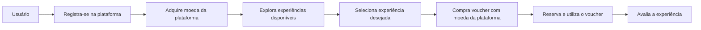
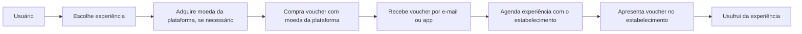

# Produto: **ExperienceVoucher**

## Descrição:

ExperienceVoucher é uma plataforma inovadora que oferece aos usuários a oportunidade de adquirir **vouchers** para experiências incríveis em **gastronomia, entretenimento, turismo, comunidade** e **vendas**. O aplicativo incentiva o crescimento dos negócios e o desenvolvimento de relações **ganha-ganha**, onde todos os envolvidos se beneficiam.

## Características:

1. **Sistema de compras de vouchers**: Os usuários podem comprar vouchers usando moedas específicas da plataforma, que podem ser trocadas por experiências em várias categorias, como gastronomia, entretenimento, turismo, comunidade e vendas.

2. **Moeda da plataforma**: A plataforma possui sua própria moeda, que pode ser adquirida pelos usuários e usada para comprar vouchers para experiências incríveis.

3. **Experiências de qualidade**: A plataforma garante que todas as experiências oferecidas sejam cuidadosamente selecionadas, proporcionando momentos memoráveis e únicos aos usuários.

4. **Incentivo aos negócios**: O aplicativo promove o crescimento e o sucesso dos negócios, permitindo que empreendedores e proprietários de empresas ofereçam suas experiências e produtos aos usuários, criando relações ganha-ganha.

5. **Consultoria para empreendedores**: Além de oferecer experiências, a plataforma também fornece consultoria e apoio a empreendedores, ajudando-os a crescer e prosperar no mercado.

6. **Aplicativo móvel user-friendly**: O ExperienceVoucher está disponível como um aplicativo móvel fácil de usar, permitindo que os usuários acessem e adquiram vouchers a qualquer momento e em qualquer lugar.

O ExperienceVoucher é uma solução completa que conecta usuários a **experiências excepcionais**, ao mesmo tempo em que promove o crescimento dos negócios e o sucesso dos empreendedores envolvidos. Com uma interface amigável e uma ampla gama de experiências disponíveis, o aplicativo é o parceiro perfeito para quem busca vivenciar momentos inesquecíveis e apoiar negócios locais.

## Jornada de Checkout

- 1 - Usuário se registra na plataforma.
- 2 - Usuário adquire a moeda da plataforma.
- 3 - Usuário explora as experiências disponíveis na plataforma.
- 4 - Usuário seleciona a experiência desejada.
- 5 - Usuário compra o voucher para a experiência selecionada usando a moeda da plataforma.
- 6 - Usuário reserva e utiliza o voucher adquirido.
- 7 - Após usufruir da experiência, usuário avalia a experiência na plataforma.

## Processo de compra do voucher e apresentação ao estabelecimento

1. Usuário escolhe a experiência desejada na plataforma.
2. Usuário adquire a moeda da plataforma, caso ainda não tenha saldo suficiente.
3. Usuário compra o voucher para a experiência selecionada usando a moeda da plataforma.
4. Usuário recebe o voucher por e-mail ou diretamente no aplicativo da plataforma.
5. Usuário agenda a experiência diretamente com o estabelecimento.
6. No dia da experiência, usuário apresenta o voucher no estabelecimento.
7. Usuário usufrui da experiência.

