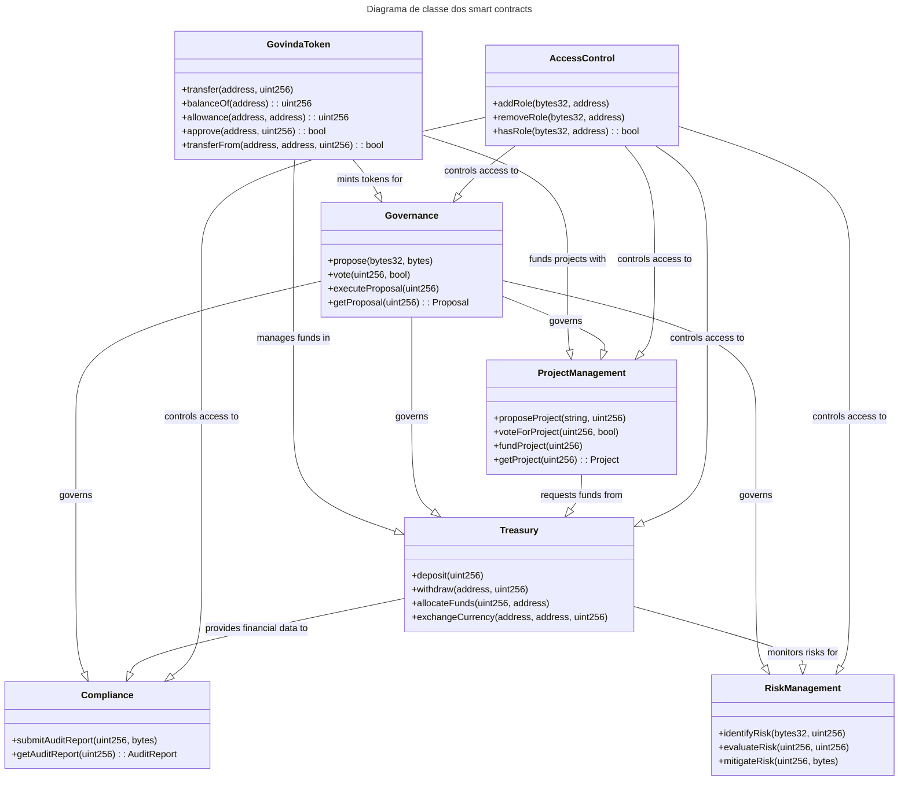

# Arquitetura de Smart Contracts da Govinda Systems DAO

## Módulos

1. `GovindaToken.sol`: Este contrato gerencia o token da Govinda Systems DAO (GOV). Ele implementa um padrão de token ERC20, permitindo a transferência, alocação e rastreamento de saldos dos titulares do token.

2. `Governance.sol`: Este contrato gerencia a governança da DAO, incluindo a criação e votação de propostas. Os membros da DAO que possuem GOV tokens podem propor e votar em propostas relacionadas à gestão e desenvolvimento da organização.

3. `ProjectManagement.sol`: Este contrato gerencia os projetos dentro da DAO. Ele permite a criação, aprovação, acompanhamento e financiamento de projetos. Os membros podem propor novos projetos e votar nos projetos existentes.

4. `Treasury.sol`: Este contrato gerencia o tesouro da DAO. Ele permite a captação e alocação de recursos para os projetos aprovados e a distribuição de recompensas para os membros e investidores. O contrato também pode interagir com exchanges e outros contratos para converter fundos entre diferentes criptomoedas.

5. `Compliance.sol`: Este contrato implementa funções de conformidade e auditoria para garantir a transparência e a aderência às regulamentações aplicáveis. Ele pode armazenar informações sobre auditorias e relatórios financeiros e disponibilizá-los para membros e investidores.

6. `RiskManagement.sol`: Este contrato gerencia a identificação, avaliação e mitigação de riscos associados à DAO. Ele pode implementar mecanismos para monitorar e alertar sobre riscos em tempo real, bem como propor e executar medidas de mitigação.

7. `AccessControl.sol`: Este contrato gerencia o controle de acesso e permissões dos membros da DAO. Ele permite definir diferentes papéis e responsabilidades para os membros, bem como limitar o acesso a determinadas funções e recursos do contrato.

Cada módulo de contrato inteligente interage entre si conforme necessário para fornecer as funcionalidades necessárias para a Govinda Systems DAO. Ao utilizar o framework Truffle, você pode facilmente compilar, implantar e testar seus contratos inteligentes, além de gerenciar o ambiente de desenvolvimento.





## 

```mermaid
classDiagram
    class GovindaSystemsDAO {
        -govCoins: uint
        +createProject(project: Project): bool
        +fundProject(project: Project, amount: uint): bool
        +getProjectDetails(project: Project): string
        +redeemGovCoinsForService(client: address, service: Service): bool
    }
    class Project {
        -title: string
        -description: string
        -budget: uint
        -status: ProjectStatus
        +updateStatus(status: ProjectStatus): void
    }
    class Service {
        -title: string
        -description: string
        -priceInGovCoins: uint
        +purchase(client: address, amount: uint): bool
    }
    enum ProjectStatus {
        PENDING
        APPROVED
        IN_PROGRESS
        COMPLETED
        CANCELED
    }
    GovindaSystemsDAO "1" -- "0..*" Project: manages
    GovindaSystemsDAO "1" -- "0..*" Service: offers
```