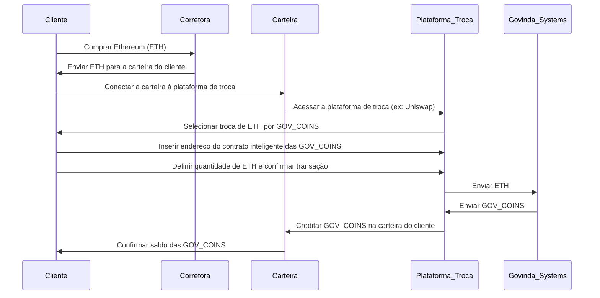
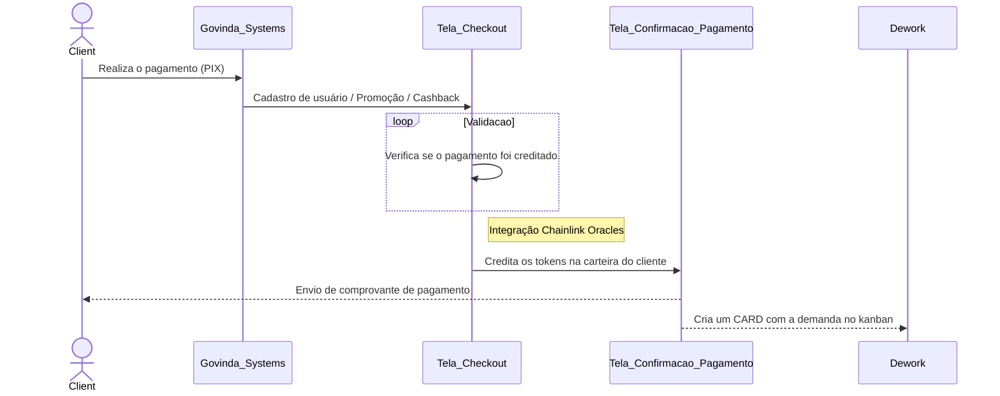

<h1 align="center">
Tokens
</h1>

Aprenda como nossos tokens funcionam.

&

Processo de cash back.

## Nossos Tokens

# Tokens da Govinda Systems DAO: Uma Introdução Simples

A Govinda Systems DAO usa três tipos diferentes de tokens: **GSTG**, **GOV_PAG**, e **GOV**. Vamos entender um pouco mais sobre cada um deles:

## GOV - Govinda Services Coin

**GOV** é o token de serviço. Serve para solicitar produtos / serviços ou pagamento de hospedagem na Govinda Systems DAO.

## GSTG - Govinda SysTems Governance

O token **GSTG** é o token de governança da Govinda Systems DAO. Se você possui GSTG, significa que você tem uma participação na organização e pode votar em decisões importantes.

## GOV_PAG - Govinda Pagamento Coin

**GOV_PAG** é o token para pagamento da Govinda Systems DAO. Essa moeda é utilizada como contas a pagar, com ela pagamos os serviços prestados pelos integrantes da comunidade.

Ao adquirir esse token, você poderá trocar por Bitcoin pela plataforma Uniswap (https://uniswap.org/).

# Como os Tokens Funcionam?

Esses tokens funcionam como um tipo especial de moeda digital que são gerados e gerenciados na blockchain. Cada token tem um valor que pode ser trocado por produtos ou serviços dentro do ecossistema da Govinda Systems DAO.

# Como Adquirir Tokens?

Para adquirir qualquer um desses tokens, você precisará seguir estes passos:

1. **Crie uma carteira de criptomoedas**: É onde você vai guardar seus tokens. Alguns exemplos de carteiras são MetaMask, Trust Wallet e MyEtherWallet.

2. **Compre Ethereum (ETH)**: Como os tokens da Govinda Systems são baseados na blockchain Ethereum, você precisa comprar ETH para trocar por tokens.

3. **Conecte sua carteira a uma plataforma de troca descentralizada**: Um exemplo popular é o Uniswap.

4. **Troque seu ETH pelos tokens que deseja**: No Uniswap, você pode trocar seu ETH por GSTG, GOV_PAG, ou GOV.

Lembre-se de sempre manter a chave privada da sua carteira segura.

> Veja no diagrama abaixo como funciona o processo de compra de GOV COINS.

Lembre-se de sempre armazenar seus tokens de maneira segura e manter a chave privada de sua carteira em local seguro e confidencial.

## Token 

