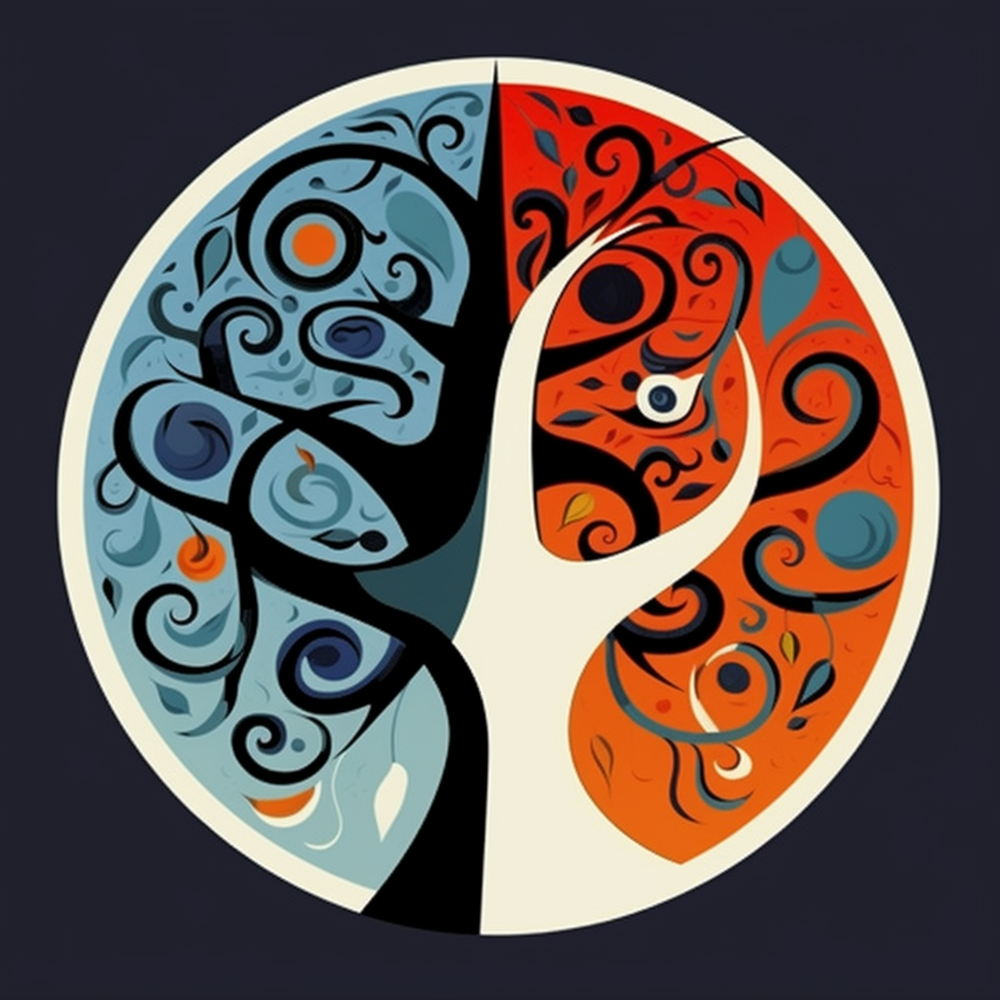

# Govinda Systems DAO (whitepaper)

A Govinda Systems DAO é uma organização descentralizada autônoma (DAO) especializada em
fornecer soluções tecnológicas e consultorias para empresas. Nossa missão é impulsionar a
inovação e transformar negócios por meio da aplicação de tecnologias emergentes e
metodologias ágeis. Nosso propósito é ajudar nossos clientes a se adaptarem às rápidas
mudanças do mercado, otimizando seus processos e alcançando melhores resultados.

## Nossos Tokens

* Token de Governança : GSTG

Govinda SysTems Governance:

O token Govinda Systems (GSTG) é usado para acessar os serviços e os detentores de GST têm direitos de voto dentro da DAO. A organização valoriza soluções inovadoras, abordagem personalizada, transparência, segurança e colaboração da comunidade. Entre os produtos oferecidos estão a criação de sites institucionais, gestão de mídias sociais e campanhas de anúncios pagos nas redes sociais.

* Token de Serviço : GOV

GOVs são adquiridos para execução de serviços. Ao adquirir GOV Coins o cliente ganha 30% de cash back.

* Token de Pagamento : GOV_PAG

A Govinda Pagamento Coin funciona como um Token de pagamento.

Você pode trocar por outras cripto moedas pelo site:

https://uniswap.org/

## **Missão:**

Nossa missão é impulsionar a
inovação e transformar negócios por meio da aplicação de tecnologias emergentes e
metodologias ágeis.

A missão da Govinda Systems DAO é ser um modelo de negócio auto sustentável e autonomo, onde é eficiente em prestar serviços de desenvolvimento de sistemas Web3 e impulcionar as vendas dos clientes. 

## **Propósito:**

A Govinda Systems DAO tem como propósito fornecer soluções financeiras descentralizadas, baseadas em tecnologia blockchain, para indivíduos e empresas. 

Temos também como propósito prestar consultoria de Agilidade e Fluxo dos processos, adoramos responder a pergunta, o que devo fazer para deixar a minha empresa mais Ágil.

Através de nossos produtos e serviços, estamos comprometidos em fornecer acesso seguro a ferramentas financeiras descentralizadas, oferecendo mais controle, transparência e privacidade aos nossos usuários.

## O nosso diferencial

Conseguimos utilizando técinicas de processos Inovadores e Tecnologias Inovadoras para obter o melhor resultado **custo e benefício** para os nossos clientes.

Somos uma empresa desentralizada e autonoma, **focada nos seguintes pilares**:

* Consultoria de Agilidade / Automação de processos **+**
* Tecnologias Web3 (**Defi** / **DApp** / **Tokenização**) **+**
* Marketing Digital

## **Transparência:** 

Estamos comprometidos em ser uma organização transparente em todos os aspectos do nosso negócio. Acreditamos que a transparência é fundamental para ganhar a confiança e a lealdade dos nossos usuários e da comunidade cripto em geral.

## Produtos & Serviços

### Consultoria Agilidade

* Transformação ágil em empresas.
* Diagnóstico de maturidade ágil da empresa.
* Criação de métricas ágeis e quadros de gestão visual.

* Mapeamento e Diagramação dos processos da Empresa
* Mapeamento de Gargalos, Desperdícios
* Mapeamento Redução de Custos dos processos
* Mapeamento de Automação de processos
* Análise de desempenho e qualidade dos processos

### Desenvolvimento Web3

* Construção de aplicativos descentralizados (dApps)
* Desenvolvimento de contratos inteligentes
* Integração de soluções DeFi (Finanças Descentralizadas)
* Testes de segurança e auditoria de contratos inteligentes
* Desenvolvimento de interfaces de usuário e experiência do usuário (UI/UX)

* **Desenvolvimento de contratos inteligentes:** a Govinda Systems DAO oferece suporte para o desenvolvimento de contratos inteligentes personalizados, que podem ser usados para criar soluções automatizadas em uma variedade de setores, incluindo finanças, saúde e energia.

* **Desenvolvimento de aplicativos descentralizados (dApps):** a Govinda Systems DAO trabalha com tecnologias como Ethereum, IPFS e Arweave para desenvolver dApps que oferecem uma experiência de usuário aprimorada e segura.

* **Integração de blockchain:** a Govinda Systems DAO ajuda empresas a integrar blockchain em seus processos existentes, permitindo a automação e o gerenciamento de dados descentralizados.

* **Segurança de blockchain:** a Govinda Systems DAO trabalha com as tecnologias mais recentes em segurança blockchain para garantir que seus clientes possam operar com segurança em ambientes descentralizados.

### Marketing digital

#### Criação de Sites institucionais e Hot Sites
* Desenvolvimento de sites institucionais e hot sites para promover produtos e serviços online.
* Criação de layouts personalizados e responsivos para diferentes dispositivos.
* Desenvolvimento de landing pages para campanhas de marketing.

#### Gestão de mídias sociais
* Análise de boas práticas de redes sociais.
* Criação de posts para as redes sociais.
* Criação de loja virtual no Instagram / Google Shopping / etc.
* Criação de campanhas de anúncios pagos nas redes sociais.
* Análise de métricas para otimização de campanhas.
* Gestão de tráfego
* Gerenciamento de campanhas de tráfego pago no Google Ads, Facebook Ads e outras plataformas.
* Otimização de campanhas para aumentar o tráfego e conversão de vendas.

### Gestão de tráfego
* Gerenciamento de campanhas de tráfego pago no Google Ads, Facebook Ads e outras plataformas.
* Otimização de campanhas para aumentar o tráfego e conversão de vendas.

### Gestão de produtos
* Análise de boas práticas para produtos online.
* Análise de portfólio de produtos.
* Criação de novos produtos e serviços.

## Prato do dia !

### E-Commerce - Marketplace

* Montagem de lojas virtuais completas e personalizadas.
* Cadastro de produtos e segmentação por categoria.
* Implementação de sistema de pagamento.
* Configuração do workflow de faturamento.
* Controle de estoque e avaliação de produtos.
* Implementação de sistema de SAC (atendimento ao cliente).
* Dashboard BI para monitoramento das vendas e estoque.
* Integração com SEO para melhorar o posicionamento nos mecanismos de busca.
* Suporte acessível e online.
* Escalabilidade para atender o crescimento do negócio.

### Automação e Telemetria com IOT

Utilizando o nosso Frame Work ganhamos agilidade ao registrar/gerencia um dispositivo IOT e coletar dados ou executar ações.

#### Sergiços

* Automação industrial para monitoramento e telemetria do processo de fabricação.

Utilizamos as tecnologias AWS IOT, Esp8266, MQTT Protocol, Blockchain, Next.js

### Jurídico
* Criação de smart contracts para automação de contratos e garantias.
* Implementação de processo Escrow para garantia de transações financeiras.
* Atualização dos termos contratuais, sob consentimento das partes.

### Compliance
* Desenvolvimento de sistemas de auditoria de processos e prevenção a fraudes
* Implementação de sistemas de votação, compliance financeira, certificado de transparência e protocolo anti-corrupção

### Treinamento
* Workshops para introdução à Web3 e criptomoedas
* Treinamentos técnicos em desenvolvimento de produtos Web3
* Treinamentos em gestão de risco e governança
* Treinamentos em marketing e comunicação para empresas Web3

### CRM

* Criação e Gestão de Cupons de Promoção.
* Estratégias de fidelização e recompensas aos Clientes.
* Ferramentas para cuidar do relacionamento com o Cliente (Módulos de cashback.)
* Atendimento ao cliente com chatbot utilizando inteligência artificial.
* Coleta de feedbacks dos clientes com dashboard de avaliações e indicadores.
* Canal de comunicação para a sua própria rede social.
* Canais de comunicação com os seu cliente.

## Versão de teste gratuita dos produtos.

Para adquirir uma versão de teste gratuita dos produtos da Govinda Systems DAO, é simples.

- 1 - Acesse o site da Govinda Systems DAO (https://www.govindasystems.com)
- 2 - Clique no botão "Teste Grátis" ou "Free Trial".
- 3 - Instale a smart Wallet MetaMask (https://www.youtube.com/watch?v=cSBp71amDZo)
- 4 - Preencha um cadastro com nome e e-mail.

* Não necessita de CARTÃO DE CREDITO ou QUALQUER MEIO DE PAGAMENTO.

## O que é uma DAO ?

Uma empresa DAO é uma organização descentralizada e autônoma que usa a tecnologia blockchain para operar. Essa tecnologia permite que a empresa seja gerenciada de forma transparente e democrática pelos seus membros, sem a necessidade de um comando centralizado. As decisões importantes são tomadas em conjunto pelos membros, que possuem poder de voto de acordo com a quantidade de tokens da empresa que possuem. A DAO é regida por um conjunto de regras predefinidas, chamadas de smart contracts, que garantem que todas as transações e decisões sejam executadas de forma segura e transparente.

Além disso, as DAOs são capazes de recompensar os membros que contribuem para o desenvolvimento da organização por meio de sua participação ativa na tomada de decisões e na realização de tarefas. Isso cria um incentivo para que os membros da comunidade se envolvam e ajudem a desenvolver a organização, resultando em um ecossistema mais colaborativo e eficiente.

As DAOs têm o potencial de revolucionar a forma como as empresas são gerenciadas, tornando-as mais transparentes, democráticas e eficientes. As DAOs podem ser usadas em vários setores, desde o desenvolvimento de tecnologia até o gerenciamento de recursos comunitários. A Govinda System DAO é um exemplo de como essa tecnologia pode ser aplicada no desenvolvimento de soluções inovadoras em Web3 e marketing digital.

## Tire suas dúvidas no nosso stack overflow

https://stackoverflowteams.com/c/govinda-systems-dao